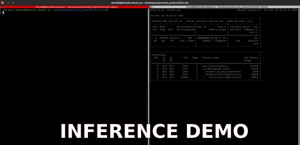

# A Small Language Model (SLM)

The SLM is a compact and efficient language model, requiring only **506 MB** of GPU memory for operation. It leverages the architecture of the [facebook/opt-125m](https://huggingface.co/facebook/opt-125m) model and has been fine-tuned with the [tatsu-lab/alpaca](https://huggingface.co/datasets/tatsu-lab/alpaca) dataset. This fine-tuning was done over **3 epochs ONLY**  using the Pretrained Encoder Fine-Tuning (PEFT) technique. You can access this model on Hugging Face at [sbmalik/finetuning-slm](https://huggingface.co/sbmalik/finetuning-slm).

A demonstration of the model in action can be viewed here:



# Getting Started with the Small Language Model

To begin using the SLM, follow these steps:

## 3. Install Required Dependencies

First, install all necessary dependencies by running the following command in your terminal:

```bash
pip install -r requirements.txt
```

## 2. Chat with the Model
You can start a chat session with the model using the command below. This will allow you to input text and receive responses from the model, with a maximum response length of 20 tokens.
```bash
python run.py --max_length 20
```
